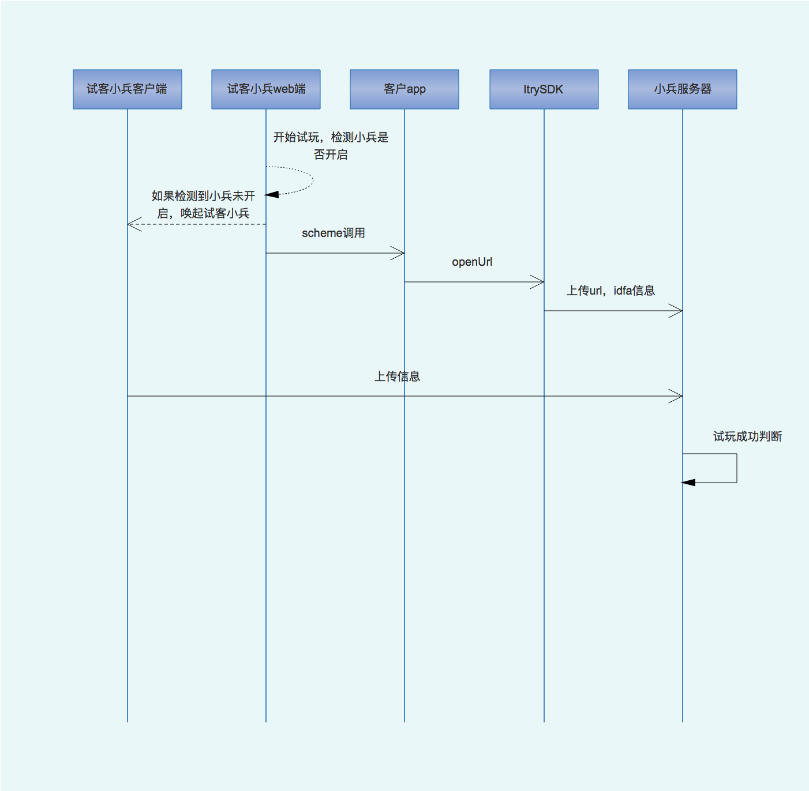

# AdmoreSDKDeepLink 使用说明
***

## 说明
1. appID：app在《多点广告开放平台》的唯一ID

2. appKey：《多点广告开放平台》分配

3. scheme头：《多点广告开放平台》分配，比如`am1234://`，需要在app的工程文件的`URL Types`项里添加: `identifier`: `admore`，`URL Schemes`: `am1234 `

4. idfa：sdk中使用了idfa，请在提交appstore审核时注意

## 使用方法
1. 将AdmoreSDK.h 和 AdmoreSDK.h放入工程，

2. 或者使用Pod安装方式：pod 'AdmoreSDKDeepLink', :git => 'https://github.com/duodiankeji/deeplink.git'

3. 中`application:didFinishLaunchingWithOptions:`中初始化

```
- (BOOL)application:(UIApplication *)application didFinishLaunchingWithOptions:(NSDictionary *)launchOptions
{
    [AdmoreSDKDeepLink setAppId:@"appId" appKey:@"appkey"];
    ...
}
```

4. 在您的AppDelegate中override `application:openURL:options:`方法，调用AdmoreSDK的`handleUrl:withAppId:`:

```
- (BOOL) application:(UIApplication *)app openURL:(NSURL *)url options:(NSDictionary<UIApplicationOpenURLOptionsKey,id> *)options {
    
    if( [AdmoreSDKDeepLink handleUrl:url] ) {
        return YES;
    }
    //处理您的其他逻辑
    return NO;
    
    //或者直接 return [AdmoreSDKDeepLink handleUrl:url];
}

```
如果您的app只支持ios9(含)以上版本，只需添加以上函数即可。如果需要支持ios9以下，则`application:handleOpenURL:`也需要处理

```
- (BOOL)application:(UIApplication *)application handleOpenURL:(NSURL *)url {
    
    if( [AdmoreSDKDeepLink handleUrl:url] ) {
        return YES;
    }
    //处理您的其他逻辑
    return NO;
    
    //或者直接 return [AdmoreSDKDeepLink handleUrl:url];
}
```
## 流程



## 关于上传接口(地址待定)
1. 使用get方式上传, 形式如下：

```
https://itry.com/admoresdk/info?a=appId&t=uploadtime&i=info
```

示例：

```
https://itry.com/admoresdk/info?a=1234&t=1484116404&i=b01308a20167267e3dceb548c134fbb2f36dbb1c2f6cfeef0eda79a2c4eb1b4253002798993f780ea85221ab4c61cb567d6a4bcb4f3438b484dc32fe41042bf1dd385c44c2de2a151c23ea88c60b70a5f74ecb5a1e13fd2633a35df0c0392e45938ab2290a862b05ab95ed64b8605a77
```

info为json的aes加密后的二进制字符串，

**aes key：**  

字符串：https://am.admore.com.cn/deeplink/info?ai=appId&ak=appkey&t=uploadtime 的md5值（32位）


**json：**

```
{
  "url" : "am1234:\/\/start?session=12&time=123",
  "idfa" : "F4F9A60C-A5AC-4D26-B168-247A66C34A3D"
}
```

## Author

mkoo, wanglin.sun@duodian.com

## License

Copyright © 2017 北京多点科技股份有限公司. All Rights Reserved
